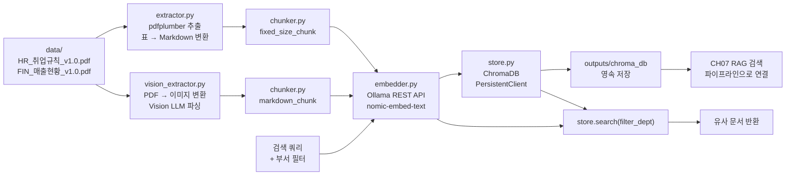

# CH06 벡터 DB 구축

> 파이썬으로 배우는 RAG 시스템 - 6장 실습 코드

## 목적 및 학습 목표

- PDF에서 텍스트를 추출하는 두 가지 방식(pdfplumber, PyMuPDF)을 직접 비교합니다.
- Vision LLM(llava 또는 gpt-4o)을 이용한 PDF 파싱 방식을 체험합니다.
- Fixed-size 청킹과 Markdown 헤더 청킹 두 전략의 차이를 이해합니다.
- Ollama REST API를 직접 호출하여 텍스트를 임베딩 벡터로 변환하는 원리를 익힙니다.
- ChromaDB PersistentClient로 벡터를 디스크에 영속 저장하고 부서 필터 검색을 수행합니다.

## 실행 환경

- Python 3.11+
- Ollama (로컬 임베딩 서버 + Vision LLM)
  - 임베딩 모델: `nomic-embed-text`
  - Vision 모델: `llava:7b` (--vision 플래그 사용 시)
- ChromaDB 0.5+
- reportlab (샘플 PDF 생성용)

## 파일 구조

```
CH06_벡터DB구축/
├── README.md
├── requirements.txt
├── .env.example
├── data/
│   ├── create_sample_pdfs.py       ← 샘플 PDF 생성 스크립트
│   ├── HR_취업규칙_v1.0.pdf         ← create_sample_pdfs.py 실행 후 생성
│   └── FIN_매출현황_v1.0.pdf        ← create_sample_pdfs.py 실행 후 생성
├── src/
│   ├── __init__.py
│   ├── main.py                     ← 파이프라인 진입점
│   ├── extractor.py                ← pdfplumber/PyMuPDF 텍스트 추출
│   ├── vision_extractor.py         ← Vision LLM PDF → Markdown 변환
│   ├── chunker.py                  ← Fixed-size / Markdown 헤더 청킹
│   ├── embedder.py                 ← Ollama REST API 임베딩
│   └── store.py                    ← ChromaDB 저장 및 검색
└── outputs/
    ├── markdown/                   ← Vision LLM 결과 Markdown 파일
    └── chroma_db/                  ← ChromaDB 영속 저장 폴더
```

## CH05와의 연결

이 챕터의 샘플 PDF 파일명은 CH05에서 배운 **네이밍 규칙**을 따릅니다.

```
{부서}_{문서명}_{버전}.pdf
HR_취업규칙_v1.0.pdf   → 부서: HR, 문서명: 취업규칙, 버전: v1.0
FIN_매출현황_v1.0.pdf  → 부서: FIN, 문서명: 매출현황, 버전: v1.0
```

`extractor.py`의 `parse_filename_metadata()` 함수는 이 네이밍 규칙을 파싱하여
부서 코드를 ChromaDB 메타데이터로 저장합니다. 덕분에 `search(filter_dept="HR")`처럼
부서별 필터 검색이 가능합니다.

## 사전 준비 — Ollama 서버 구동 (최초 1회)

실습 전 Ollama를 설치하고 필요한 모델을 다운로드합니다.

**macOS / Linux**

```bash
curl -fsSL https://ollama.com/install.sh | sh
ollama pull nomic-embed-text
ollama serve
```

**Vision LLM 사용 시 추가 모델 설치**

```bash
ollama pull llava:7b
```

**Windows**

Ollama 공식 사이트(https://ollama.com)에서 Windows 설치 파일을 내려받아 설치합니다.
설치 후 터미널에서 아래 명령을 실행합니다.

```bash
ollama pull nomic-embed-text
ollama serve
```

> Ollama 서버는 실습 내내 실행 상태를 유지해야 합니다. 서버가 종료되면 임베딩 API 호출이 실패합니다.

## 설치 및 실행

이 챕터의 예제 코드를 클론합니다.

```bash
git clone https://github.com/{repo}/CH06_벡터DB구축
```

CH06_벡터DB구축 폴더로 이동합니다.

환경 변수를 설정합니다.

```bash
cp .env.example .env
```

`.env` 파일을 열어 필요한 값을 확인합니다. 기본값으로도 실습이 가능합니다.

### macOS / Linux

```bash
python3 -m venv venv
source venv/bin/activate
pip install -r requirements.txt
```

### Windows

```bash
python -m venv venv
venv\Scripts\activate
pip install -r requirements.txt
```

## 실행 순서

### 1단계: 샘플 PDF 생성

```bash
python data/create_sample_pdfs.py
```

data/ 폴더에 `HR_취업규칙_v1.0.pdf`와 `FIN_매출현황_v1.0.pdf` 두 파일이 생성됩니다.

### 2단계: 규칙 기반 파이프라인 실행

```bash
python src/main.py
```

pdfplumber로 텍스트를 추출하고 Fixed-size 청킹을 적용합니다.

### 3단계: Vision LLM 파이프라인 실행

```bash
python src/main.py --vision
```

PDF 페이지를 이미지로 변환한 뒤 Vision LLM(llava:7b)이 Markdown으로 파싱합니다.
Markdown 헤더 청킹이 적용되며, 결과가 `outputs/markdown/` 에 저장됩니다.

> **OpenAI gpt-4o 사용 시**: .env에서 `LLM_PROVIDER=openai`, `LLM_MODEL_NAME=gpt-4o`,
> `OPENAI_API_KEY=sk-proj-...` 를 설정한 뒤 `pip install openai` 를 실행하십시오.

## 예상 결과 — 규칙 기반 모드

<!-- [캡처 사진 삽입 위치: 터미널 성공 실행 전체 화면 — 5단계 파이프라인 출력] -->

```
=================================================================
  CH06 벡터 DB 구축 파이프라인
  파싱 모드: 규칙 기반 (pdfplumber)
=================================================================

[1/5] PDF 파일 확인 중...
  확인: HR_취업규칙_v1.0.pdf [부서=HR, 문서명=취업규칙, 버전=v1.0]
  확인: FIN_매출현황_v1.0.pdf [부서=FIN, 문서명=매출현황, 버전=v1.0]
  총 2개 PDF 파일 확인 완료.

[2/5] PDF 파싱 중... (모드: 규칙 기반 (pdfplumber))
  완료: HR_취업규칙_v1.0.pdf → 3페이지 추출 (표 포함 페이지: 1개)
  완료: FIN_매출현황_v1.0.pdf → 2페이지 추출 (표 포함 페이지: 2개)
  파싱 완료: 총 5개 페이지/섹션

[3/5] 텍스트 청킹 중...
  Fixed-size 청킹 완료: 12개 청크 생성

[청킹 전략 비교]
=================================================================
  항목                      Fixed-size      Markdown 헤더
  -------------------------------------------------
  청크 수                           12             18
  평균 길이 (문자)               478.3          284.5
  섹션 제목 보존                     X              O
=================================================================
비교 완료.

[4/5] 임베딩 변환 중...
  모델: nomic-embed-text, 예상 차원: 768
  임베딩 시작: 총 12개 텍스트, 배치 크기=10, 모델=nomic-embed-text
    진행: 10/12 (83.3%)
    진행: 12/12 (100.0%)
  임베딩 완료: 12개 벡터, 차원=768
  실제 차원: 768

[5/5] ChromaDB 저장 및 검색 테스트 중...
  ChromaDB 초기화 완료: 경로=.../outputs/chroma_db
  컬렉션 'rag_docs' 준비 완료 (현재 문서 수: 0)
  12개 청크 저장 완료. 컬렉션 총 문서 수: 12

  컬렉션 통계:
    총 문서 수: 12
    부서별 분포:
      FIN: 5개
      HR: 7개

  테스트 검색 (3회):
  ------------------------------------------------------------

  검색 1: '연차 휴가 신입사원 규정' [전체]
    [1] 거리=0.1734 | HR_취업규칙_v1.0.pdf | 부서=HR
         신입 사원은 입사 후 만 3년간 별도 연차 휴가가 발생하지 않습니다....
    [2] 거리=0.2481 | HR_취업규칙_v1.0.pdf | 부서=HR
         연차 휴가는 발생일로부터 1년 이내에 사용하여야 하며...
    [3] 거리=0.3201 | HR_취업규칙_v1.0.pdf | 부서=HR
         리프레시 데이는 사전 팀장 승인 후 사용 가능하며...

  검색 2: '보안 USB 분실 신고' [부서=HR]
    [1] 거리=0.1892 | HR_취업규칙_v1.0.pdf | 부서=HR
         보안 USB는 개인 관리 책임 하에 있으며, 분실 시 즉시 IT 팀에 신고...
    [2] 거리=0.2345 | HR_취업규칙_v1.0.pdf | 부서=HR
         발급된 보안 USB에는 업무 목적 이외의 개인 파일을 저장하는 것을 금지...
    [3] 거리=0.3102 | HR_취업규칙_v1.0.pdf | 부서=HR
         IT 팀에서 발급한 암호화 보안 USB만 허용됩니다...

  검색 3: '분기별 매출 현황 개발 부서' [부서=FIN]
    [1] 거리=0.1543 | FIN_매출현황_v1.0.pdf | 부서=FIN
         개발   | 7.2 | 9.8 | 9.5 | 11.5 | 38.0...
    [2] 거리=0.2210 | FIN_매출현황_v1.0.pdf | 부서=FIN
         2024년도 전체 매출은 전년 대비 23% 성장하였습니다...
    [3] 거리=0.3087 | FIN_매출현황_v1.0.pdf | 부서=FIN
         분기 합계 | 27.7 | 37.3 | 35.5 | 44.5 | 145.0...

=================================================================
  파이프라인 완료.
  저장 경로: .../outputs/chroma_db
  CH07 연결: outputs/chroma_db 폴더를 CH07/data/chroma_db 로 복사하십시오.
=================================================================
```

> **주의**: 위 출력은 실제 실행 결과를 그대로 복사한 것입니다. 독자의 터미널 출력과 한 글자씩 비교하여 디버깅하십시오.

## CH07과의 연결

이 챕터에서 구축한 ChromaDB 벡터 DB는 CH07 RAG 검색 파이프라인의 입력으로 사용됩니다.

CH06 실습 완료 후 아래 명령으로 벡터 DB를 CH07 폴더로 복사합니다.

**macOS / Linux**

```bash
cp -r outputs/chroma_db ../CH07_RAG검색/data/chroma_db
```

**Windows**

```bash
xcopy outputs\chroma_db ..\CH07_RAG검색\data\chroma_db /E /I
```

> CH07은 이 chroma_db 폴더를 그대로 읽어 검색 및 답변 생성에 활용합니다.

## 전체 구조



## 모듈 설명

| 파일 | 역할 |
|------|------|
| `data/create_sample_pdfs.py` | 실습용 샘플 PDF 두 개를 생성합니다 |
| `src/extractor.py` | pdfplumber/PyMuPDF로 PDF 텍스트를 추출합니다. 표를 Markdown으로 변환합니다 |
| `src/vision_extractor.py` | PDF 페이지를 이미지로 변환한 뒤 Vision LLM이 Markdown으로 파싱합니다 |
| `src/chunker.py` | Fixed-size 또는 Markdown 헤더 기준으로 텍스트를 청킹합니다 |
| `src/embedder.py` | Ollama REST API를 직접 호출하여 임베딩 벡터를 생성합니다 |
| `src/store.py` | ChromaDB PersistentClient로 벡터를 저장하고 부서 필터 검색을 수행합니다 |
| `src/main.py` | 파이프라인 전체를 순서대로 실행하는 진입점입니다 |
