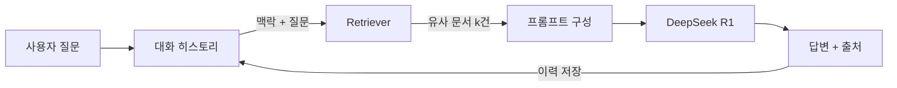

# CH07 집필 명세 — RAG Q&A 엔진 구현

## 1. 챕터 섹션 구조

- ## 1. LangChain RAG 파이프라인 설계: LCEL 기반 RAG Chain 구조. Retriever -> Prompt -> LLM -> Output Parser
- ## 2. 유사도 검색 및 컨텍스트 구성: ChromaDB Retriever 설정, k값 조정, 검색 결과를 프롬프트 컨텍스트로 조합
- ## 3. 출처 표시 시스템: 응답에 참조 문서의 출처(파일명, 페이지)를 자동 첨부하는 구현
- ## 4. 대화 히스토리와 멀티턴 Q&A: ChatMessageHistory를 활용하여 이전 대화 맥락을 유지하는 멀티턴 RAG 구현. 단발 Q&A에서 대화형 비서로 확장
- ## 5. 기본 채팅 인터페이스 연결: 터미널 기반 대화형 Q&A 루프 구현 (멀티턴 적용)
- ## 6. 정리하며: RAG Q&A 엔진 완성 확인 + 8장 예고

## 2. 코드-섹션 매핑

| 섹션 | 파일 | 코드 범위 |
|------|------|---------|
| 섹션 1 | `src/rag_chain.py` | `build_rag_chain()`, LCEL 파이프라인 정의 |
| 섹션 2 | `src/retriever.py` | `get_retriever()`, k값 설정, 필터 옵션 |
| 섹션 3 | `src/citation.py` | `format_with_sources()`, 출처 메타데이터 추출 |
| 섹션 4 | `src/memory.py` | `get_chat_history()`, ChatMessageHistory 설정, RunnableWithMessageHistory 래핑 |
| 섹션 5 | `src/chat.py` | `chat_loop()`, 터미널 입출력 (멀티턴 대화 루프) |
| 전체 | `src/main.py` | 엔드투엔드 실행 |

## 3. 개념 설명 힌트 (Why)

- LCEL을 사용하는 이유: LangChain Expression Language는 파이프라인을 선언적으로 구성하여 가독성과 유지보수성이 높음
- 출처 표시가 중요한 이유: 사내 AI 비서는 신뢰성이 핵심. 근거 없는 응답은 실무에서 사용 불가
- 대화 히스토리가 필요한 이유: 실무 AI 비서는 "아까 물어본 직원의 부서는?" 같은 후속 질문에 대응해야 함. 단발 Q&A만으로는 비서 역할을 수행할 수 없음
- ChatMessageHistory를 선택하는 이유: LangChain 0.3의 표준 메모리 인터페이스. RunnableWithMessageHistory와 조합하여 기존 RAG Chain을 최소한의 수정으로 멀티턴 지원 가능
- 터미널 인터페이스로 시작하는 이유: UI 복잡도를 최소화하고 RAG 파이프라인 자체에 집중

## 4. 핵심 용어

- LCEL(LangChain Expression Language): LangChain의 파이프라인 구성 문법. `|` 연산자로 체이닝
- Retriever: 벡터 DB에서 관련 문서를 검색하는 컴포넌트
- Source Citation: 응답의 근거가 된 원본 문서 출처를 표시하는 기능
- Output Parser: LLM 출력을 구조화된 형식으로 변환하는 컴포넌트
- ChatMessageHistory: LangChain에서 대화 이력을 저장하고 관리하는 인터페이스
- 멀티턴 대화(Multi-turn Conversation): 이전 대화 맥락을 유지하며 연속적으로 질의응답하는 방식

## 5. Mermaid 다이어그램 초안

## 6. 챕터 연결

- 이전 챕터에서 가져오는 개념: ChromaDB 컬렉션, 유사도 검색 (CH06)
- 다음 챕터로 넘기는 개념: RAG Chain, Retriever, 출처 표시, 멀티턴 대화 시스템 (CH08에서 통합 에이전트에 결합)
