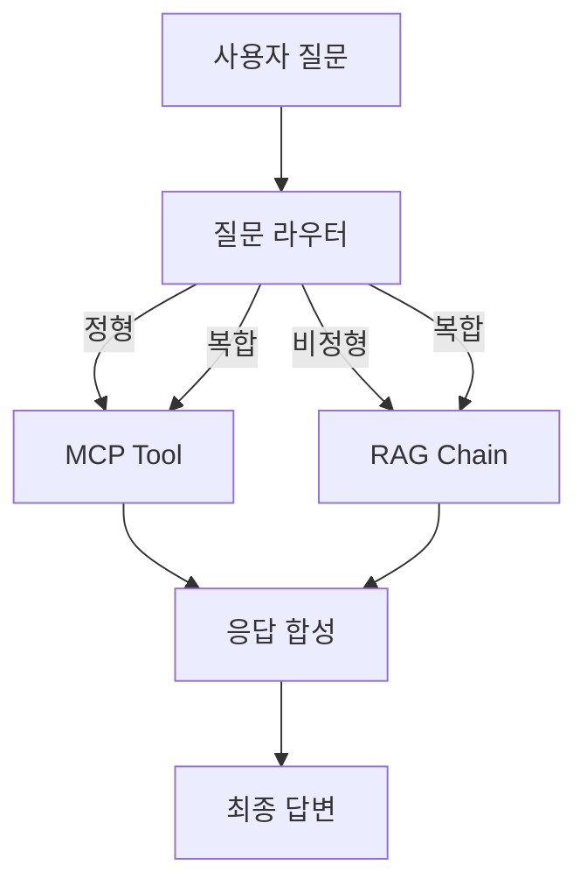

# CH08 집필 명세 — 통합 에이전트 설계 (MCP + RAG)

## 1. 챕터 섹션 구조

- ## 1. 정형/비정형 분리 원칙: 어떤 질문이 DB 조회(정형)이고 어떤 질문이 문서 검색(비정형)인지 분류 기준 수립
- ## 2. 질문 라우팅 전략: 규칙 기반 라우팅에서 LLM 판단 기반 라우팅으로 진화. 라우터 프롬프트 설계
- ## 3. 통합 응답 전략: DB 조회 결과 + 문서 검색 결과를 LLM이 합성하여 단일 응답 생성
- ## 4. 대표 질문 시나리오 10개 실습: 정형, 비정형, 복합 질문별 실행 결과 확인 및 분석
- ## 5. 정리하며: 에이전트 설계 패턴 요약 + 9장 예고

## 2. 코드-섹션 매핑

| 섹션 | 파일 | 코드 범위 |
|------|------|---------|
| 섹션 1 | (설계 문서) | 질문 유형 분류 매트릭스 |
| 섹션 2 | `src/router.py` | `classify_question()`, 규칙 기반 + LLM 판단 라우터 |
| 섹션 3 | `src/agent.py` | `integrated_response()`, DB+RAG 결과 합성 |
| 섹션 4 | `src/scenarios.py` | 10개 시나리오 정의 및 실행 |
| 전체 | `src/main.py` | 시나리오 일괄 실행 |

## 3. 개념 설명 힌트 (Why)

- 정형/비정형 분리가 필요한 이유: "김철수 잔여 연차" 는 DB 조회, "연차 규정" 은 문서 검색. 혼동하면 응답 품질 급락
- 규칙 기반에서 LLM 판단으로 진화하는 이유: 키워드 매칭은 한계가 있으며, LLM이 의도를 파악하면 더 유연한 라우팅 가능
- 통합 응답이 필요한 이유: "김철수의 남은 연차와 관련 규정은?" 같은 복합 질문은 두 소스를 동시에 조회해야 함

## 4. 핵심 용어

- 질문 라우팅(Question Routing): 질문 유형에 따라 적절한 처리 경로로 분기하는 로직
- 정형 데이터(Structured Data): 테이블 형태의 데이터 (DB)
- 비정형 데이터(Unstructured Data): 문서, PDF 등 자유 형식 데이터
- 응답 합성(Response Synthesis): 여러 소스의 결과를 LLM이 자연어로 통합하는 과정

## 5. Mermaid 다이어그램 초안

## 6. 챕터 연결

- 이전 챕터에서 가져오는 개념: RAG Chain + 출처 표시 (CH07), MCP 개념 (CH04), CRUD API 구조 (CH04)
- 다음 챕터로 넘기는 개념: 라우터 설계 패턴, 통합 응답 전략, 시나리오 기반 검증 방법
